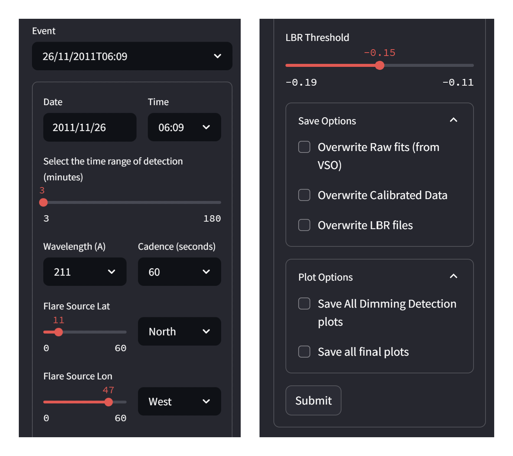
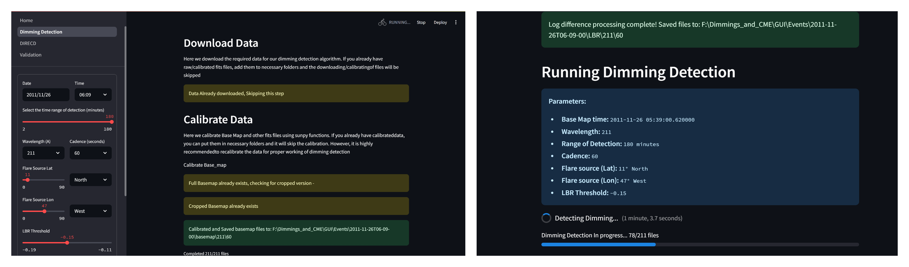

Introduction
====================

DIRECD (Dimming Inferred Estimation of CME Direction) is a novel method
to characterize the early CME propagation direction from the expansion of coronal dimmings. 

For more details refer to our article: 

Graphical User Interface
------------

The DIRECD-soft GUI is developed to provide the necessary tools to perform early CME direction analysis using 
coronal dimmings. This package has been built in Python (3.12) with an extensive use of libraries available within
the Python language ecosystem. The GUI of this application has been built based on Streamlit, an open-source Python 
library that provides an easy way to create web applications and tested on windows-based operating system.

Home page
-------------

The application's Home page features a brief introduction to the software alongside key publications detailing the DIRECD method. 
A navigation panel on the left side lists all available pages, allowing users to initiate an analysis by selecting the Dimming Detection
module.

Dimming detection page
--------------

Detecting coronal dimmings is a process that benefits greatly from visual feedback and iterative adjustment. 
The user aims to accurately identify and segment dimming regions by configuring a set of detection parameters and evaluating 
the results against solar observations. DIRECD-soft provides a streamlined solution for this analysis. 
Its intuitive graphical user interface, also built on Streamlit, facilitates an efficient and user-guided detection process.  

The DIRECD-soft web application features a dedicated Dimming Detection page, which is organized into two primary vertical panels. 
The left panel serves as a control center, hosting all input widgets that allow you to configure the detection parameters and 
control the analysis. Conversely, the right panel is dedicated to data visualization, displaying all graphical outputs including 
plots and results to provide immediate visual feedback. This clear separation of controls and outputs enhances the application's 
usability, enabling you to refine your analysis with ease.  

To begin, the user initiates the process by selecting a pre-defined event from the “Event” dropdown menu or by defining a custom event. 
The software currently supports EUV images from SDO/AIA. Key parameters include the event’s date and approximate time, the 
detection time range (which defaults to 180 minutes), the wavelength (193 or 211 Å), and the image cadence (12 to 60 seconds). 
The flare source location is specified in heliographic latitude and longitude and must be within ±60° to be compatible with the 
DIRECD method. Finally, the user selects the threshold for dimming detection from three predefined options (-0.11, -0.15, -0.19) to execute the detection. 
Additional options allow for the automatic saving of plots and overwriting previous results. 

    Fig 1. Selection panels of the Dimming Detection page

Upon submission of the selected parameters, DIRECD-soft retrieves the corresponding solar data from the Virtual Solar Observatory (VSO)
using SunPy’s data acquisition interface, Fido. The downloaded data, stored in the standard Flexible Image Transport System (FITS) 
format, is automatically saved in the directory:  
         Events/
            └── YYYY-MM-DDTHH-MM-SS/  (event timestamp)
                └── fits/  
The algorithm also downloads the basemap for dimming detection, which by default captures data from 30 minutes prior to the event start
time. To optimize efficiency and avoid redundant downloads, DIRECD-soft checks the local database before initiating a new data request. 
For each search, the software verifies whether the required dataset—corresponding to the specified date, time, wavelength, and
cadence—already exists in local storage and skips the download process if found.

Following data retrieval, the pipeline automatically executes calibration procedures. These include differential rotation correction, 
resampling to 1024X1024 pixel images, cropping maps to a 1000X1000 arcsec area centered on the flare source, and the generation of 
logarithmic base-ratio images essential for dimming detection. Once calibrated, the dimming detection algorithm processes each image 
sequentially, constructing a cumulative dimming mask that tracks the evolution of dimming regions. The final mask, referred to as the 
timing map, is stored in the /Events/YYYY-MM-DDTHH-MM-SS/Timing/ directory. To optimize computational efficiency, DIRECD-soft does not save 
intermediate detection images by default. However, enabling the ”Save All Dimming Detection Plots” option in the plotting settings 
preserves each step of the detection process and generates a video of the dimming progression. Following dimming detection, the program 
calculates the dimming area derivative (dA/dT), identifies the maximum and the end of the impulsive phase—defined as the point when 
dimming falls to 15% of its maximum value—and saves this information in a .txt file in the root folder and in the ”variables” directory 
for subsequent DIRECD analysis.

    Fig 2. Working of Dimming Detection page

DIRECD analysis page
--------------

After you have generated your dimming masks using the Dimming Detection tool, proceed to the DIRECD page to perform a 
Coronal Mass Ejection (CME) analysis.
**Page Layout & Initial Setup**
 - The DIRECD page has a similar layout to the Dimming Detection page but includes additional analysis controls.
 - The base map for comparison is automatically set to a time 30 minutes before the flare's start.

**Choosing a Time:**

- Recommended (Default): For the most reliable results, use the default selection, which is set to the end of the flare's impulsive 
phase. This timestamp has been rigorously validated for the DIRECD method. You may also manually select any other timestamp from the 
list for your analysis.

**Cone Edge Detection:**

- Automated Detection (Default): Selects the optimal cone edges to maximize the coverage of the dimming region.
- Manual Adjustment: If you wish to override the automated result, select the Manual Edge Detection option in the left-hand panel. This
 will allow you to interactively select and adjust the cone edges yourself.

**Results & Output Files:**

Once the analysis is complete, the following outputs will be generated:

- A plot showing the best-fit cone overlaid on the dimming mask.

- Txt files: All results are saved as text files in your root directory. These files contain:

    * The derived CME parameters (3D/2D direction, speed, width).
    * The complete set of cone parameters for all generated cones (height, width, inclination angle).

Comparison
---------------