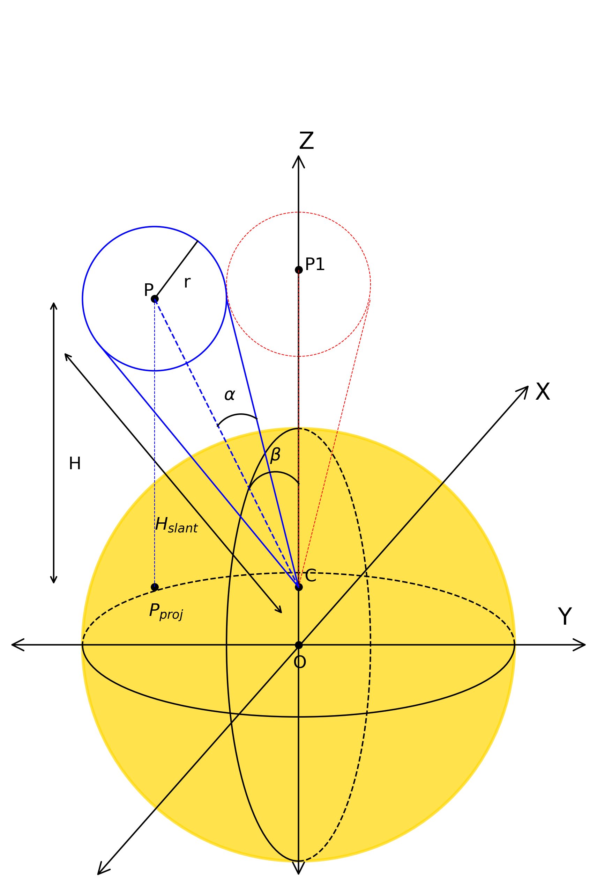
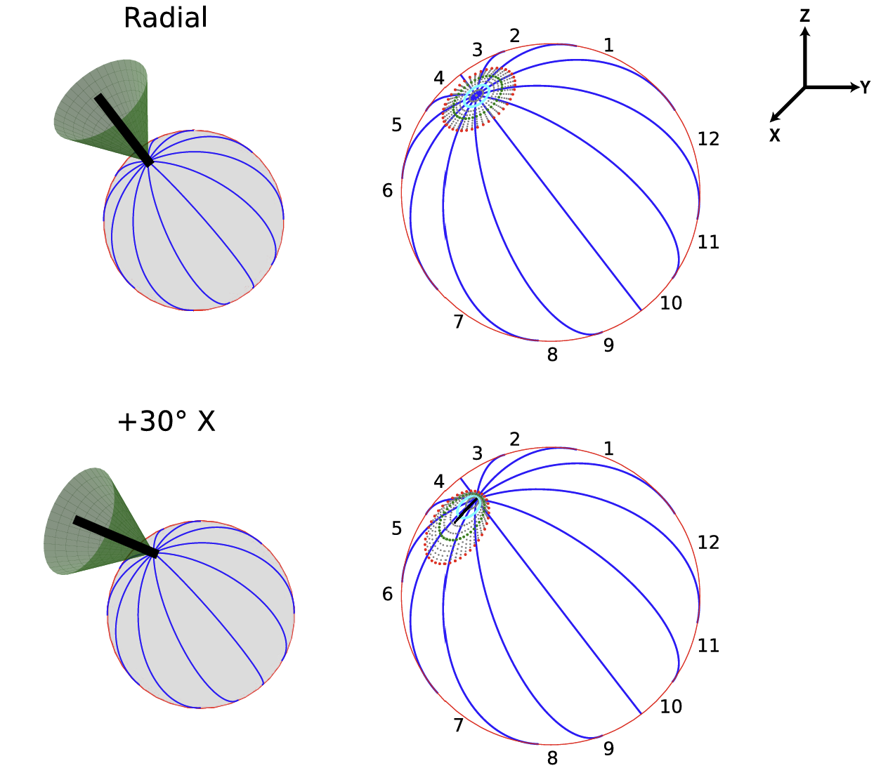

For more details refer to our article: 

Cone Construction
------------------------------------

Figure 1 illustrates a 2D schematic of the cone structure. The red cone represents the radially oriented cone, while the blue cone is
inclined at an angle β relative to the radial direction. The parameter α denotes the half-width of the cone, point C marks
the source location, and O indicates the Sun’s center. The perpendicular height of point P from its orthogonal projection P\ :sub:`proj`
on the surface is denoted as H, and H\ :sub:`slant` represents the slant height of the cones.

The slant height of the cone H\ :sub:`slant` is: 

.. math::

   H_{\text{slant}} = \sqrt{(P_{x} - C_{x})^2 + (P_{y} - C_{y})^2 + (P_{z} - C_{z})^2}

where :math:`(C_{x}, C_{y}, C_{z})` and :math:`(P_{x}, P_{y}, P_{z})` are the :math:`(x, y, z)` coordinates of the flare source :math:`C`.

The radius of the base of the cone :math:`r` is related to slant height :math:`H_{\text{slant}}` as:

.. math::

   H_{\text{slant}} = r \cdot \tan \alpha

The inclination angle :math:`\beta` is given by:

.. math::

   \beta = \arccos\left( \frac{\vec{v}_1 \cdot \vec{v}_2}{\|\vec{v}_1\| \|\vec{v}_2\|} \right)

where :math:`\vec{v}_1` is the vector between Sun center and :math:`C` and :math:`\vec{v}_2` is the vector between :math:`C` and :math:`P`.

    Fig 1. Schematic of the cone geometry in 2D. The red cone is aligned radially, while the blue cone is tilted by an angle β relative
    to the radial axis. The half-angle of the cone is α, with C denoting the source position and O marking the solar center. H is the 
    perpendicular height of point P above its surface projection P\ :sub:`proj`, and H\ :sub:`slant` indicates the slant height of the 
    cones.

Orthogonal Projection
---------------------------

The orthogonal projections of the cone on the solar surface can be described by the following equation:

.. math::
    
    X_{\text{ortho}} = \frac{R_{\text{sun}} \cdot X_c}{\sqrt{X_c^2 + Y_c^2 + Z_c^2}},   
    Y_{\text{ortho}} = \frac{R_{\text{sun}} \cdot Y_c}{\sqrt{X_c^2 + Y_c^2 + Z_c^2}},   
    Z_{\text{ortho}} = \frac{R_{\text{sun}} \cdot Z_c}{\sqrt{X_c^2 + Y_c^2 + Z_c^2}}  

Here, X\ :sub:`ortho`,  Y\ :sub:`ortho`, and  Z\ :sub:`ortho` denote the Cartesian coordinates of the orthogonal 
projections, while  X\ :sub:`c`,  Y\ :sub:`c`, and  Z\ :sub:`c` represent the three-dimensional coordinates of the cone. 
The parameter R\ :sub:`sun` corresponds to the solar radius in kilometers.

